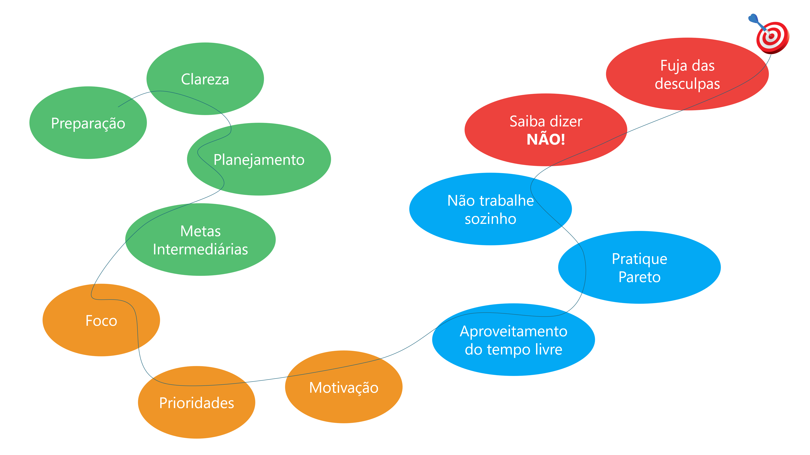

# CURSO DE ALTA PRODUTIVIDADE

## Como perder tempo
1. Fazer muitas coisas ao mesmo tempo, paralisando cada uma para fazer outra.
2. Usar memória sem anotar o que fazer amanhã.
3. Realizar esforços desnecessários como criar um atalho na area de trabalho.
4. Celular com notificações;
5. Delegando atividades.

## O que é produtividade
É a medida do uso dos recursos que eu tenho para realizar uma tarefa em determinado tempo.

## Principios chave para alta produtividade
- Preparação: estar pronto antecipadamente para tudo;
- Clareza de caminho: saber para onde quer ir (opções x distrações);
- Planejamento: pensar de antemão como vou fazer as coisas;
- Metas Intermediarias: Dividir uma tarefa grande em tarefas menores;;
- Foco: pensar no que você quer, igual ao gps do carro que foca onde quer ir e mesmo que precise mudar rota vai pro mesmo lugar em foco;
- Prioridades: priorizar tarefas. Tabela Valor x Complexidade, levando o eixo x como valor e prioridade.
- Motivação: vem de nós mesmos e seguir as 4 etapas:
    1. relembrar por que fazemos as coisas, qual o motivo;
    2. Imaginar você no futuro atingindo os seus objetivos;
    3. Comemorar todas as pequenas conquistas.
- Aproveitar Períodos de Inativade para realizar tarefas sem prioridade, ouvir podcasts, ver vídeo/palestras, desenhar e programar;
- Ser efetivo: atingir um resultado esperado, ao inves de ser eficiente que é saber fazer algo bem. Principio de Paretto (20% para atingir 80% dos resultados);
- Não centralize as atividades, faça as coisas em equipe;
- Não apenas ouça mas explore a voz da experiência. Aprender com os mentores;
- Aprender a dizer não, saber o que deve e o que não deve ser prioriodade na sua vida;
- Não dê desculpas, busca avançar para aprender.

