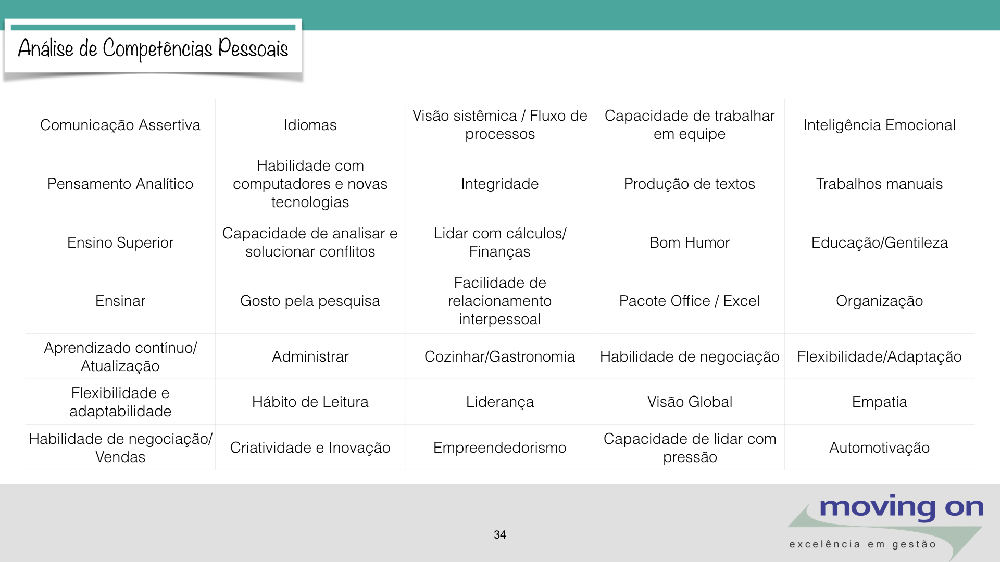

# AULA 1 - COMPETÊNCIAS COMPORTAMENTAIS

Parte fundamental do nosso trabalho é a integração e desenvolvimento de competências comportamentais essenciais. Abaixo, destacamos algumas das competências que consideramos cruciais para o sucesso no ambiente de trabalho:

## Comunicação Assertiva

A comunicação assertiva é a habilidade de expressar pensamentos, sentimentos e opiniões de forma clara, direta e respeitosa. É essencial para garantir uma troca eficaz de informações entre os membros da equipe e os colaboradores externos.

## Inteligência Emocional

A inteligência emocional é a capacidade de reconhecer, compreender e gerenciar as próprias emoções, bem como compreender e influenciar as emoções dos outros. É importante para lidar com situações de pressão, resolver conflitos e promover um ambiente de trabalho saudável e produtivo.

## Pensamento Analítico

O pensamento analítico envolve a habilidade de analisar problemas de forma crítica, identificar padrões, tendências e relações de causa e efeito. É crucial para compreender e resolver problemas complexos de desenvolvimento de software de maneira eficiente e eficaz.

## Flexibilidade/Adaptabilidade

A flexibilidade e a adaptabilidade são habilidades que permitem ajustar-se a mudanças, novas circunstâncias e desafios imprevistos. São essenciais para responder de forma ágil e eficaz às demandas do projeto, especialmente em um ambiente de constante evolução tecnológica.

## Relacionamento Interpessoal

O relacionamento interpessoal refere-se à capacidade de interagir e se relacionar de forma positiva e construtiva com outras pessoas. É fundamental para promover a colaboração, a troca de ideias e o trabalho em equipe no desenvolvimento de software.

## Aprendizado Contínuo

O aprendizado contínuo é a disposição e o compromisso de adquirir novos conhecimentos, habilidades e competências ao longo da vida profissional. É essencial para se manter atualizado e competitivo em um campo como o desenvolvimento de software, onde as tecnologias e as melhores práticas estão sempre mudando.

# AULA 2 - TENDÊNCIAS E INOVAÇÕES

- Novas Tecnologias
- Job Hopping
- Geração nem-nem
- Fortalecimento da cultura organizacional
- Desenvolvimento Profissional - Feedback
- Upskilling/Reskilling
- Softskills
- Longlife learning

# AULA 3 - ANALISE PESSOAL

- Zona de Conforto (sei tudo), Zona do medo (coisas que não conheço), Zona do Aprendizado (começo a me acostumar, aprendendo as coisas) e Zona de Crescimento.

# AULA 4 - CONSTRUINDO MINHA CARREIRA

- Cultura: tudo que constrói um determinado ambiente seja um país, cidade ou até mesmo uma família;
- Valores: principios que norteiam a conduta humana na sociedade como disciplina, leitura, tempo livre, gratidão, respeito, liberdade e igualdade;
- Ética: A índole, caráter, natureza, morada e abrigo. Analise de uma situação social de acordo com valores pessoais;
- Propósito: qual meu objetivo, minhas motivações?
- Valores -> Competencias -> Propósito

# AULA 5 - SUGESTÃO DE LIVROS

Nessa aula são recomendados os livros "Por que fazemos o que fazemos" e "Comece pelo porquê".

# AULA 6 - GESTÃO DO CONHECIMENTO

- Aprendizado contínuo, buscar ler mais e visando ser profissional T-Shapped (especialista na sua área e generalista no restante).
- Competências (CHA) Conhecimento, Atitude e Habilidade.
- Analise de competencias:

Exercicio: Verificar o que eu possuo do quadro abaixo e o que ainda devo desenvolver

# AULA 7 - NETWORKING E RELACIONAMENTOS
- Via de mão dupla: ajudo e sou ajudado;
- Evitar ações sem reprocidade e sem empatia;
- Redes Sociais como ponte de contato e conteúdo saúdavel;
- Gestão de Relacionamentos: Envio de mensagens de agradecimentos, responder as pessoas, saudação para manter contato e pessoas com quem devo marcar um café para trocar ideias.

# AULA 8 - GESTÃO DE MUDANÇAS
- Análise SWOT (Strenght- Weakness - Oportunities - Threat)

# AULA 9 - PAINEL DE IDEAÇÃO:
- Montar plano de ação nos painéis padlet;

# AULA 10 - LIVRO SOFTSKILLS
Leitura de uma frase de cada capitulo do livro softskills.

# AULA 11 - COMPORTAMENTOS/ATITUDES FUNDAMENTAIS
- Integridade;
- Determinação;
- Aprendizado Contínuo;
- Disciplina.